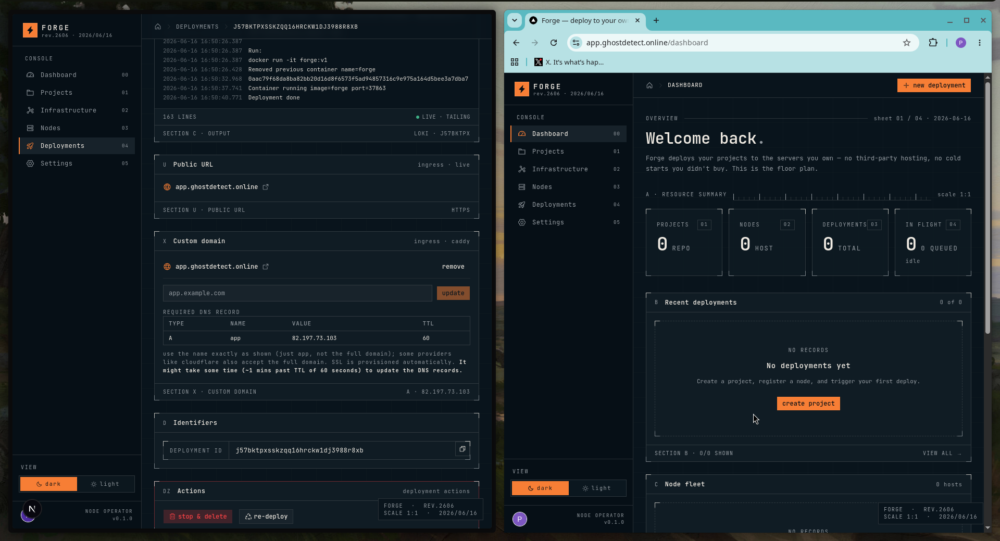
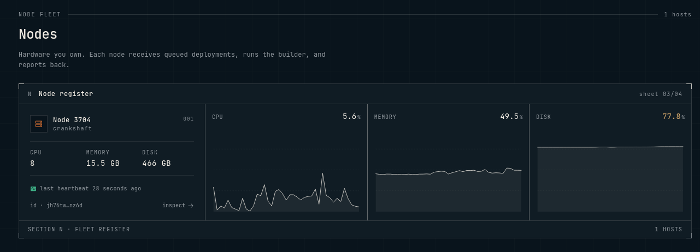
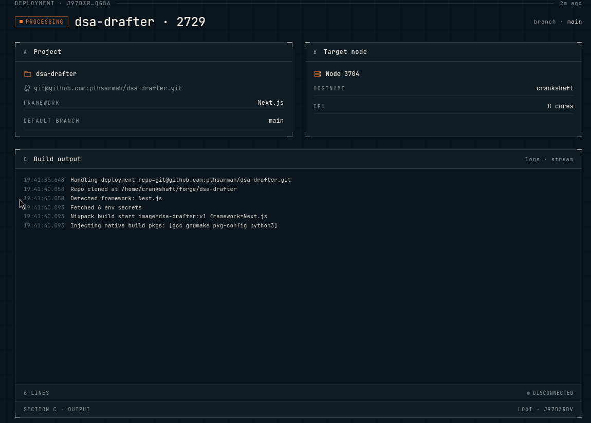

# Forge

Forge is a self-hosted deployment platform. You connect your own servers, and
Forge deploys Git projects and infrastructure services to them. It gives each
deployment a public URL, manages environment secrets, and watches health.



Forge has two parts:

- **Control plane** (this repo) — a Next.js web app backed by Convex. This is
  where you manage servers, projects, deployments, and secrets.
- **Agent** — a separate Go program ([`forge-agent`](../forge-agent)) that runs
  on each of your servers. It polls the control plane over HTTP and does the
  actual work: building images, running containers, and reporting status.

The control plane never connects out to your servers. Agents always reach in.

## Concepts

- **Node** — one of your servers running the agent. Reports CPU, memory, disk,
  and a heartbeat.
- **Project** — a Git repository to deploy. Forge detects the framework and
  builds it with [Nixpacks](https://nixpacks.com).
- **Infra** — a prebuilt service (database, cache, etc.) deployed from a Docker
  Compose template.
- **Deployment** — one running instance of a project or infra on a node.
- **Environment / Secrets** — environment variables for a project or infra.
  Secrets are encrypted before they are stored.

Each node reports its resources and a heartbeat so you can see the fleet at a
glance:



## How a deployment works

1. You create a project or infra and assign it to a node.
2. The agent on that node polls `/deployments/queued` and picks up the work.
3. The agent fetches the deployment's secrets, runs any install and
   post-install steps, then builds and starts the container.
4. The agent reports status and health back to the control plane.
5. Forge exposes the deployment through a Cloudflare Tunnel and assigns a public
   URL. You can also map a custom domain.

Build output streams live while the agent works:



## Requirements

- Node.js 20+
- A [Convex](https://convex.dev) deployment (self-hosted or cloud)
- A [Clerk](https://clerk.com) application for authentication
- A [Cloudflare](https://cloudflare.com) account (for tunnels and domains)
- Redis (for deployment logs)
- One or more servers running the agent

## Setup

Install dependencies:

```bash
npm install
```

Create a `.env.local` file and fill in the values (see below).

Start Convex and the web app:

```bash
npx convex dev
npm run dev
```

Open [http://localhost:3000](http://localhost:3000).

## Environment variables

| Variable | Purpose |
| --- | --- |
| `NEXT_PUBLIC_CONVEX_URL` | Convex deployment URL |
| `NEXT_PUBLIC_CONVEX_SITE_URL` | Convex HTTP actions URL |
| `CONVEX_SELF_HOSTED_URL` | Convex backend URL (self-hosted) |
| `CONVEX_SELF_HOSTED_ADMIN_KEY` | Convex admin key (self-hosted) |
| `NEXT_PUBLIC_CLERK_PUBLISHABLE_KEY` | Clerk publishable key |
| `CLERK_SECRET_KEY` | Clerk secret key |
| `CLERK_WEBHOOK_SECRET` | Verifies Clerk user webhooks |
| `NEXT_PUBLIC_CLERK_SIGN_IN_URL` | Sign-in route |
| `NEXT_PUBLIC_CLERK_SIGN_UP_URL` | Sign-up route |
| `NEXT_PUBLIC_CLERK_SIGN_IN_FALLBACK_REDIRECT_URL` | Redirect after sign-in |
| `NEXT_PUBLIC_CLERK_SIGN_UP_FALLBACK_REDIRECT_URL` | Redirect after sign-up |
| `CLOUDFLARE_API_TOKEN` | Manages tunnels and DNS |
| `CLOUDFLARE_ACCOUNT_ID` | Cloudflare account |
| `CLOUDFLARE_ZONE_ID` | Cloudflare DNS zone |
| `REDIS_HOST` | Redis host (deployment logs) |
| `REDIS_PORT` | Redis port |
| `PROMETHEUS_URL` | Source for node metrics |
| `MASTER_KEY` | Encrypts and decrypts secrets |
| `CADDY_SYNC_SECRET` | Authenticates custom-domain config sync |

## HTTP API

The control plane exposes HTTP endpoints (Convex HTTP actions) that the agent
and external services call.

**Agent — deployments**

| Method | Path | Purpose |
| --- | --- | --- |
| POST | `/deployments/queued` | Get deployments waiting to run |
| PATCH | `/deployments/status` | Report deployment status |
| POST | `/deployments/pending-deletes` | Get deployments to remove |
| POST | `/deployments/finalize-delete` | Confirm a removal |
| PATCH | `/deployments/infra-health` | Report infra health |

**Agent — nodes, env, post-install**

| Method | Path | Purpose |
| --- | --- | --- |
| POST | `/nodes/heartbeat` | Report node health and resources |
| POST | `/nodes/delete-node` | Remove a node |
| GET | `/environments/secrets` | Fetch a deployment's secrets |
| POST | `/postinstall/queued` | Get post-install steps to run |
| POST | `/postinstall/result` | Report a post-install result |
| PATCH | `/projects/framework` | Report the detected framework |

**Webhooks and domains**

| Method | Path | Purpose |
| --- | --- | --- |
| POST | `/clerk-users-webhook` | Sync users from Clerk |
| POST | `/github-webhook` | Trigger a deploy on push |
| GET | `/domains/authorize` | Authorize a custom domain |

## Project layout

```
src/app/          Next.js routes (dashboard, projects, deployments, infras, nodes)
src/components/    UI components
src/lib/           Client helpers (formatting, validation, URL generation)
convex/            Backend: schema, queries, mutations, actions, HTTP routes
convex/lib/        Cloudflare tunnels, Redis, URL generation
```

Each Convex feature folder (`deployments`, `nodes`, `projects`, `infra`,
`environments`, `secrets`, `users`) holds its own queries, mutations, and
actions. The database schema is defined in `convex/schema.ts`.

## Scripts

| Command | What it does |
| --- | --- |
| `npm run dev` | Start the web app in development |
| `npm run build` | Build for production |
| `npm run start` | Run the production build |
| `npm run lint` | Lint the code |
